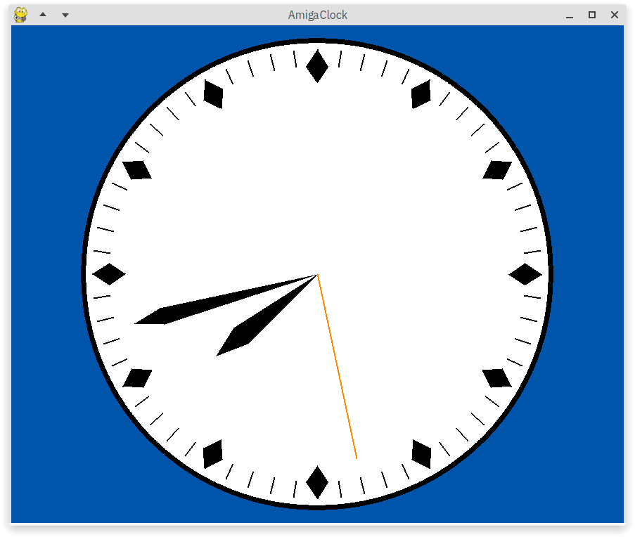
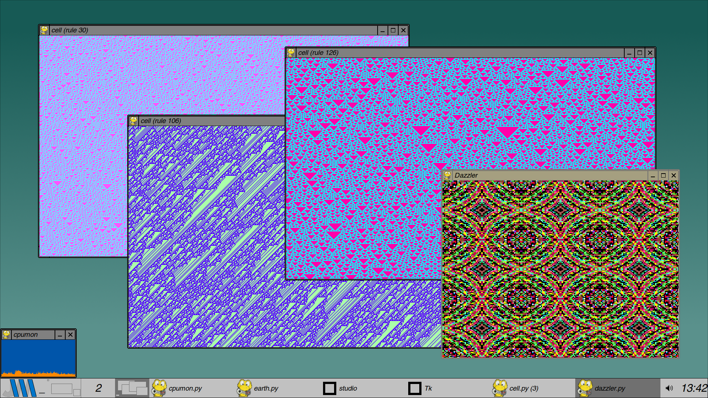
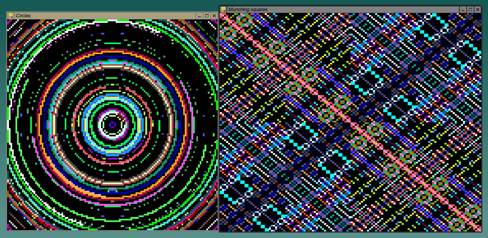
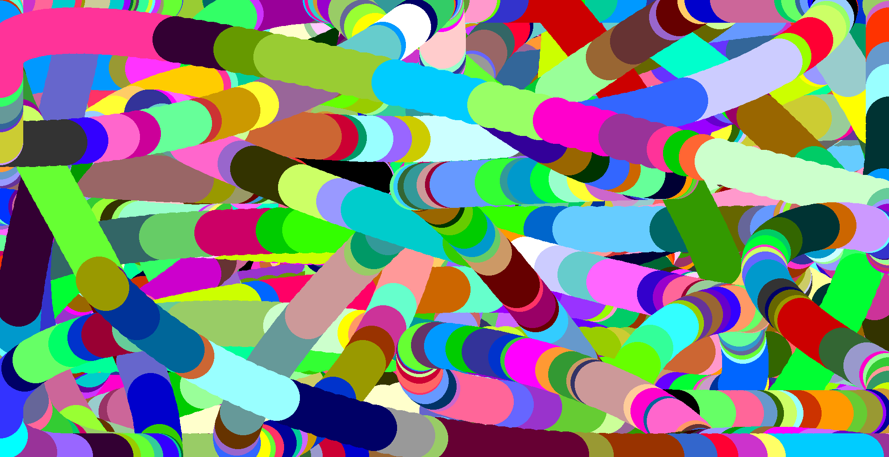

## AmigaOS 1.3 clock in PyGame

An analog [Amiga](https://en.wikipedia.org/wiki/Amiga) clock and several other graphics experiments and small utilites in PyGame:

### Clocks and timers

* aclock/aclock2/amigaclock: Amiga-inspired analog clocks in different designs
* hexclock: colorful RGB clock
* oclock: "on-line clock" with modem dialing sound, meant to track daily time spent online. Use "o" to toggle online status, "r" for daily reset.
* pomo: activity timer (20 minutes green, 5 minutes red; reset with "r" key)
* smoothclock: like amigaclock but with smooth second hand movement
* swatch: Swatch Internet Time (aka "Beats") clock
* syncclock: same as tclock, except it uses ntpdate to synchronize computer time to a time server every 30 minutes
* tclock: a simple digital text clock in HH:MM:SS format

### Other programs

* cell: [cellular automata](https://en.wikipedia.org/wiki/Elementary_cellular_automaton), press Space for a new pattern
* cpumon: simple CPU usage monitor (needs [psutil](https://github.com/giampaolo/psutil))
* dazzler: graphics demo inspired by the 1970s [Cromemco Dazzler kaleidoscope demo](https://www.youtube.com/watch?v=2tDbn1N8EWI)
* duffing: [Duffing oscillator](https://en.wikipedia.org/wiki/Duffing_equation) phase space plots; new random parameters are picked every 20 s.
* intergal: intergalactic supercomputer panel, inspired by the [bigclivedotcom video](https://www.youtube.com/watch?v=7f8jgvvJe-Q); basically a big array of LEDs blinking at _almost_ .5 Hz which slowly desynchronize. Needs NumPy.
* minsky: [Minsky circles](https://www.hakmem.org/#item149)
* munch: colorful [munching squares](https://www.hakmem.org/#item146)
* netmon: network activity monitor
* wall: wallpaper algorithm from *The New Turing Omnibus: Sixty-Six Excursions in Computer Science*
* worm: a circle moves around randomly (animated by 1-D Perlin noise) and leaves a colorful trail behind (press Return to save a screenshot)

### License

Public Domain / CC0

